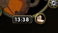
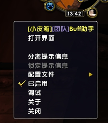
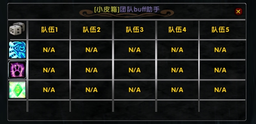
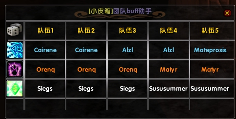
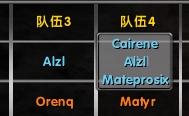

# 小皮箱团队BUFF助手 乌龟服特供
## 这个插件只是专门为了小皮箱定制 [https://github.com/PluieYu/G_RaidBuff]
### 参考了很多不同类型的插件
### 必要前置插件 AceLibrary 2.0 Babble-Spell-2.2 SpellStatus-1.0
### 或者已经安装了整合版的 !Libs

下载 zip 格式文件

下载地址 https://github.com/PluieYu/G_RaidBuff/archive/refs/heads/main.zip

解压 G_RaidBuff-main.zip 到 interface/Addons/

重命名 G_RaidBuff-main 到 G_RaidBuff 即可

### 更新日志

#### 1.1 版本 
添加自动回复功能 需要手动在小地图图标右键中 打开 “自动回复”
自动检测团队聊天 遇到关键词 智力 耐力 爪子 触发 自动回复

#### 1.0 版本 
基础功能完成

### 使用方法
1 小地图右键选择 蜡烛图标

单击打开界面

主界面如下

#### 自动分配
左键点击左上角 筛子 按钮自动分配BUFF

#### 手动分配
左键 点击队伍位置 可以手动分配BUFF

右键 点击队伍位置 可以清除buff分配

#### 发送通报
主界面 智力 耐力 爪子 图标

左键点击: 团队通报

右键点击: 清除此buff的分配

